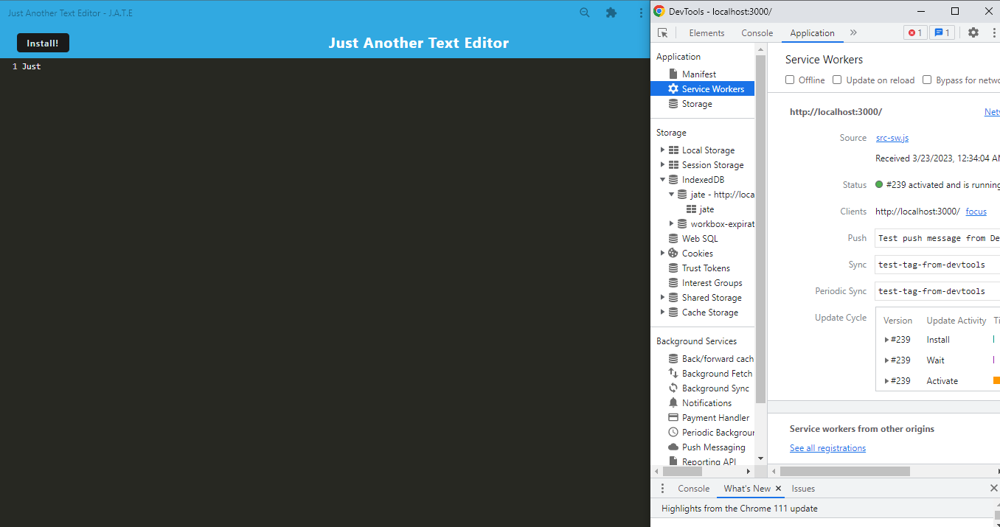

# J.A.T.E.-JustAnnasTextEditor
  [View deployed application](https://just-annas-text-editor.herokuapp.com/)

  [Github repo](https://github.com/ampatte/J.A.T.E.-JustAnnasTextEditor)

  

  ## Description
  This project is a PWA or Progressive Web Application that will run in the browser functioning even when offline.

  ## Table of Contents
  - [Installation Instructions](#Installation)
  - [Usage Information](#Usage)
  - [Contribution Guidelines](#Contribution)
  - [Test Instructions](#Test)
  - [Questions](#Questions)
  - [License](#License)
  
  ## Installation
  To run this application, all that is required is navigating to the url.

  ## Usage
  This app can be useful while studying or creating new projects by allowing a user to save and retrieve notes and code snippets, even with out internet.
  
  
  ## Contribution
  I am the only contributor.

  ## Test
  Test by trying out the application and checking that the input is cached and saved .

  ## Questions?
  - Github link: https://github.com/ampatte
  - Email link: ampatte717@gmail.com

  ## License
    This project is covered under the ISC license.(https://www.isc.org/licenses/)
